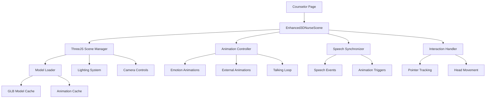

# Design Document: 3D Nurse Model Integration

## Overview

This design outlines the integration of a sophisticated 3D nurse model into the existing AI counselor interface. The solution will replace the current simple 2D NurseScene component with a React Three Fiber-based 3D implementation that includes emotion-based animations, speech synchronization, interactive features, and seamless integration with existing counselor functionality.

The design leverages the existing Three.js infrastructure and converts the vanilla JavaScript implementation from the "nurce ui" folder into a modern React/TypeScript component architecture.

## Architecture

### High-Level Architecture



### Component Hierarchy

```
Enhanced3DNurseScene (Main Component)
├── ThreeJSCanvas (React Three Fiber Canvas)
│   ├── Scene (Three.js Scene)
│   ├── Camera (Perspective Camera with Controls)
│   ├── Lighting (Ambient + Directional + Emotion Light)
│   ├── NurseModel (Main 3D Model)
│   └── ExternalAnimationModel (Temporary External Models)
├── LoadingOverlay (Loading State UI)
├── ErrorFallback (Error State with 2D Fallback)
└── PerformanceMonitor (FPS and Performance Tracking)
```

### State Management

The component will use React hooks and context for state management:

- **Model State**: Loading status, error states, model references
- **Animation State**: Current emotion, active animations, talking status
- **Interaction State**: Pointer position, head orientation targets
- **Performance State**: FPS monitoring, quality settings

## Components and Interfaces

### Core Components

#### Enhanced3DNurseScene Component

```typescript
interface Enhanced3DNurseSceneProps {
  emotion?: EmotionType;
  isTalking?: boolean;
  onModelLoad?: () => void;
  onError?: (error: Error) => void;
  fallbackComponent?: React.ComponentType;
}

type EmotionType = 'neutral' | 'happy' | 'sad' | 'thinking' | 'talking' | 
                   'listening' | 'hi' | 'yes' | 'no' | 'rest';
```

#### ThreeJS Scene Manager

```typescript
interface SceneManagerProps {
  emotion: EmotionType;
  isTalking: boolean;
  onPointerMove: (x: number, y: number) => void;
  onPointerLeave: () => void;
}

interface SceneState {
  model: THREE.Object3D | null;
  mixer: THREE.AnimationMixer | null;
  externalModel: THREE.Object3D | null;
  externalMixer: THREE.AnimationMixer | null;
  isLoading: boolean;
  error: Error | null;
}
```

#### Animation Controller

```typescript
interface AnimationControllerProps {
  model: THREE.Object3D;
  mixer: THREE.AnimationMixer;
  emotion: EmotionType;
  availableAnimations: THREE.AnimationClip[];
}

interface AnimationState {
  currentEmotion: EmotionType;
  isPlaying: boolean;
  currentClip: THREE.AnimationClip | null;
  talkingLoopActive: boolean;
}
```

#### Speech Synchronizer

```typescript
interface SpeechSynchronizerProps {
  onSpeechStart: () => void;
  onSpeechEnd: () => void;
  isTalking: boolean;
}

interface TalkingLoopConfig {
  animations: string[];
  currentIndex: number;
  isActive: boolean;
}
```

### Hooks and Utilities

#### useThreeJSModel Hook

```typescript
interface ModelLoadResult {
  model: THREE.Object3D | null;
  animations: THREE.AnimationClip[];
  mixer: THREE.AnimationMixer | null;
  isLoading: boolean;
  error: Error | null;
  loadModel: (url: string) => Promise<void>;
}

const useThreeJSModel = (modelUrl: string): ModelLoadResult;
```

#### useAnimationController Hook

```typescript
interface AnimationControlResult {
  playAnimation: (name: string) => void;
  setEmotion: (emotion: EmotionType) => void;
  startTalkingLoop: () => void;
  stopTalkingLoop: () => void;
  playExternalAnimation: (key: string, fallback?: EmotionType) => void;
}

const useAnimationController = (
  mixer: THREE.AnimationMixer | null,
  animations: THREE.AnimationClip[]
): AnimationControlResult;
```

#### usePointerTracking Hook

```typescript
interface PointerTrackingResult {
  pointerPosition: { x: number; y: number };
  headOrientation: { tilt: number; turn: number };
  resetPointer: () => void;
}

const usePointerTracking = (): PointerTrackingResult;
```

## Data Models

### Emotion Configuration

```typescript
interface EmotionState {
  label: string;
  color: number; // Hex color for lighting
  tilt: number; // Head tilt angle
  turn: number; // Head turn angle
  bob: number; // Breathing/idle animation intensity
  eyeColor: number; // Eye indicator color
}

const emotionStates: Record<EmotionType, EmotionState> = {
  neutral: { label: 'Calm focus', color: 0x6be4ff, tilt: 0, turn: 0, bob: 0.018, eyeColor: 0x9bf7ff },
  happy: { label: 'Bright & caring', color: 0xb3ffcb, tilt: -0.04, turn: 0.02, bob: 0.028, eyeColor: 0xffffff },
  // ... other emotions
};
```

### Animation Configuration

```typescript
interface AnimationConfig {
  name: string;
  clipName: string;
  isOneShot: boolean;
  duration?: number;
  loop: THREE.LoopMode;
}

const emotionClips: Record<EmotionType, string> = {
  neutral: 'Idle',
  happy: 'Wave',
  sad: 'Sad',
  thinking: 'Thinking',
  talking: 'Talking',
  listening: 'Listening',
  hi: 'Hi',
  yes: 'Yes',
  no: 'No',
  rest: 'Idle'
};
```

### Model Cache Structure

```typescript
interface CachedModel {
  scene: THREE.Object3D;
  animations: THREE.AnimationClip[];
  timestamp: number;
}

interface ModelCache {
  main: CachedModel | null;
  external: Map<string, CachedModel>;
  maxAge: number;
  cleanup: () => void;
}
```

## Error Handling

### Error Types and Recovery

```typescript
enum ModelError {
  LOAD_FAILED = 'LOAD_FAILED',
  WEBGL_UNSUPPORTED = 'WEBGL_UNSUPPORTED',
  ANIMATION_FAILED = 'ANIMATION_FAILED',
  PERFORMANCE_ISSUE = 'PERFORMANCE_ISSUE'
}

interface ErrorRecoveryStrategy {
  error: ModelError;
  fallback: () => void;
  retry?: () => Promise<void>;
  userMessage: string;
}
```

### Fallback Mechanisms

1. **WebGL Detection**: Check for WebGL support before initializing 3D scene
2. **Model Load Failure**: Fallback to existing 2D NurseScene component
3. **Animation Failure**: Continue with basic model without animations
4. **Performance Issues**: Reduce quality settings or disable advanced features
5. **Memory Issues**: Implement proper cleanup and resource disposal

## Testing Strategy

### Unit Testing Approach

- **Component Testing**: Test React components in isolation using React Testing Library
- **Hook Testing**: Test custom hooks with @testing-library/react-hooks
- **Three.js Logic**: Test 3D scene logic with Jest and Three.js test utilities
- **Animation System**: Test animation state transitions and timing
- **Error Handling**: Test all fallback scenarios and error recovery

### Property-Based Testing

Property-based tests will validate universal behaviors across different inputs and states, ensuring the 3D integration maintains correctness under various conditions.

### Integration Testing

- **Speech Synchronization**: Test coordination between TTS and animations
- **Emotion Mapping**: Verify correct animation selection for each emotion state
- **Performance**: Test frame rate maintenance under different loads
- **Responsive Behavior**: Test 3D scene adaptation to different screen sizes
- **Fallback Integration**: Test seamless fallback to 2D when 3D fails

## Correctness Properties

*A property is a characteristic or behavior that should hold true across all valid executions of a system-essentially, a formal statement about what the system should do. Properties serve as the bridge between human-readable specifications and machine-verifiable correctness guarantees.*

### Property 1: Model Loading and Fallback Consistency
*For any* 3D model loading attempt, if the load fails for any reason (network, WebGL, file corruption), the system should automatically fallback to the 2D representation and display appropriate error messaging without breaking the user interface.
**Validates: Requirements 1.3, 6.3, 8.1, 8.2**

### Property 2: Emotion-Animation Mapping Completeness
*For any* valid emotion state from the defined emotion set, the animation system should have a corresponding animation and successfully transition to that state with appropriate lighting and visual feedback.
**Validates: Requirements 2.1, 2.2, 5.1, 5.2**

### Property 3: Speech-Animation Synchronization
*For any* text-to-speech event (start, end, cancel), the animation system should synchronize appropriately by starting talking loops on speech start, stopping on speech end, and immediately stopping on cancellation.
**Validates: Requirements 3.1, 3.2, 3.4**

### Property 4: Talking Loop Variation
*For any* talking loop session, the system should cycle through multiple talking animations to create natural variation rather than repeating the same animation.
**Validates: Requirements 3.3**

### Property 5: Pointer Tracking Response
*For any* pointer movement within the 3D scene bounds, the head orientation should adjust to follow the pointer, and when the pointer leaves the bounds, the head should return to neutral position without interfering with active emotion animations.
**Validates: Requirements 4.1, 4.2, 4.4**

### Property 6: Responsive Layout Adaptation
*For any* viewport size change, the 3D model should maintain appropriate positioning, scaling, and visibility within the layout constraints.
**Validates: Requirements 1.4, 1.5**

### Property 7: Resource Management and Caching
*For any* model or animation resource, the system should implement proper caching to avoid redundant downloads and dispose of resources correctly when components unmount to prevent memory leaks.
**Validates: Requirements 6.2, 6.4**

### Property 8: External Animation Integration
*For any* available external animation file, the system should load, cache, and integrate it seamlessly with the main animation system, falling back to basic animations if external files fail to load.
**Validates: Requirements 2.5, 8.3**

### Property 9: Lighting and Visual Feedback Consistency
*For any* emotion state change, all visual feedback systems (lighting, eye indicators, status displays) should update consistently to reflect the new emotional context.
**Validates: Requirements 5.3, 5.4, 5.5**

### Property 10: Existing Feature Preservation
*For any* existing counselor feature (voice input, chat functionality, quick tags, keyboard shortcuts, accessibility), the feature should continue to work correctly after 3D integration with appropriate 3D visual feedback.
**Validates: Requirements 7.1, 7.2, 7.3, 7.4, 7.5**

### Property 11: One-Shot Animation State Management
*For any* one-shot animation (hi, yes, no), when the animation completes, the system should return to the appropriate base emotion state without getting stuck in intermediate states.
**Validates: Requirements 2.3**

### Property 12: Error Recovery and User Experience
*For any* error condition (performance issues, animation failures, resource problems), the system should provide appropriate recovery options, log debugging information, and maintain user experience continuity.
**Validates: Requirements 8.4, 8.5**